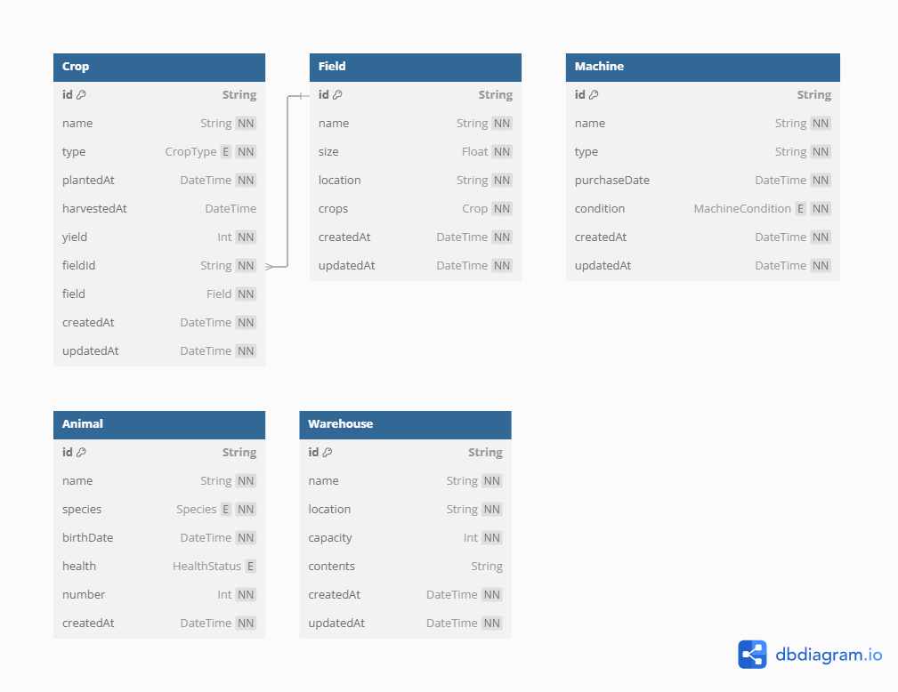

# Farm Management Dashboard

## Opis projektu

Farm Management Dashboard to nowoczesna aplikacja webowa umożliwiająca zarządzanie gospodarstwem rolnym. Aplikacja została stworzona z myślą o rolnikach oraz zarządcach gospodarstw, którzy potrzebują intuicyjnego i efektywnego narzędzia do monitorowania i planowania działań.

## Technologie

Projekt wykorzystuje następujące technologie:

Po stronie servera:

- Nest.js
- TypeScript
- Prisma
- MongoDB

Po stronie klienta:

- React
- TypeScript
- Redux
- Vite
- Tailwind CSS

## Funkcjonalności

- **Zarządzanie uprawami** – możliwość dodawania, edytowania i monitorowania upraw
- **Ewidencja zwierząt** – dodawanie, edycja i monitorowanie zwierząt
- **Pola uprawne** – dodawanie, edycja i monitorowanie pól.
- **Uprawy** – dodawanie upraw i przypisywanie ich do pola
- **Maszyny** – dodawanie , edycja i monitorowanie stanu maszyn
- **Magazyny** – dodawanie, edycja i monitorowanie stanu magazynów
- **Autoryzacja i uwierzytelnienie** – logowanie i rejestracja nowych użytkowników

## Projekt graficzny

**Figma:** [Link](https://www.figma.com/design/guX7cNrLpVMqYbFrD9UhHm/Farm-Dashboard?node-id=164-75&t=FSwea2TUMQbAwJLR-0)

### Uprawy

- Lista upraw z możliwością filtrowania po typie i dacie zasiewu
- Szczegóły uprawy: typ, data zasiewu, data zbioru, przypisane pole
- Możliwość dodawania i edytowania upraw

### Pola

- Mapa pól gospodarstwa
- Lista pól z informacjami o rozmiarze i uprawach
- Szczegółowy widok pola: lokalizacja, powierzchnia, historia upraw

### Maszyny

- Lista maszyn z informacjami o stanie technicznym
- Szczegóły maszyny: nazwa, typ, data zakupu, stan techniczny
- Harmonogram konserwacji i napraw
- Rejestr wykorzystania maszyny

### Magazyny

- Lista magazynów z pojemnością i aktualną zawartością
- Szczegółowy widok magazynu: lokalizacja, pojemność, przechowywane zasoby
- Historia dostaw i zużycia
- Zarządzanie stanami magazynowymi

### Zwierzęta

- Lista zwierząt z informacjami o gatunku i stanie zdrowia
- Szczegółowe informacje: data urodzenia, kondycja, produktywność
- Historia chorób i leczenia

## Diagram klas

[Szczegółowy diagram](https://dbdiagram.io/d/67b1aeed263d6cf9a04ece33)

## Przyszłe usprawnienia

- Integracja z API pogodowym do prognozowania warunków atmosferycznych
- Dodanie zadań do wykonania
- Obsługa wielu użytkowników i uprawnień

## Stan Projektu

#### Client

- [ ] Strona główna
  - [ ] Strona otwarcia
  - [ ] O Nas
  - [ ] Funkcje
  - [ ] Cennik
  - [ ] Kontakt
- [ ] Logowanie
- [ ] Rejestracja
- [ ] Dashboard
  - [ ] Strona głowna statystyki
  - [ ] Pola
    - [x] Reducer i akcje
    - [ ] Wyswietlanie listy pol
    - [ ] Widok szczegolowy pola
    - [ ] Dodanie nowego pola
    - [ ] Edycja pola
  - [ ] Uprawy
    - [ ] Reducer i akcje
    - [ ] Wyswietlanie listy upraw
    - [ ] Widok szczegolowy uprawy
    - [ ] Dodanie nowej uprawy
    - [ ] Edycja uprawy
  - [ ] Maszyny
    - [ ] Reducer i akcje
    - [ ] Wyswietlanie listy maszyn
    - [ ] Widok szczegolowy maszyny
    - [ ] Dodanie nowej maszyny
  - [ ] Zwierzeta
    - [ ] Reducer i akcje
    - [ ] Wyswietlanie listy zwierzat
    - [ ] Widok szczegolowy zwierzeta
    - [ ] Dodanie nowego zwierzeta
    - [ ] Edycja zwierzeta
  - [ ] Magazyny
    - [ ] Reducer i akcje
    - [ ] Wyswietlanie listy magazynow
    - [ ] Widok szczegolowy magazynu
    - [ ] Dodanie nowego magazynu
  - [ ] Przedmioty
    - [ ] Reducer i akcje
    - [ ] Wyswietlanie listy przedmiotow
    - [ ] Widok szczegolowy przedmiotu
    - [ ] Dodanie nowego przedmiotu
    - [ ] Edycja przedmiotu

#### Server

- [x] Logowanie
- [x] Rejestracja
- [x] Pobranie użytkownikow 🔒
- [x] Pola
  - [x] Operacje CRUD
- [x] Uprawy
  - [x] Operacje CRUD
- [x] Maszyny
  - [x] Operacje CRUD
  - [x] Aktualizacja stanu maszyny
- [x] Zwierzeta
  - [x] Operacje CRUD
  - [x] Aktualizacja stanu zdrowia
- [x] Magazyny
  - [x] Operacje CRUD
  - [x] Pobranie przedmiotów z magazynu
- [x] Przedmioty
  - [x] Operacje CRUD

## Licencja

Projekt jest dostępny na licencji MIT.

---

**Autor:** [Grzegorz Banaszak](https://github.com/GrzegorzBanaszak)
